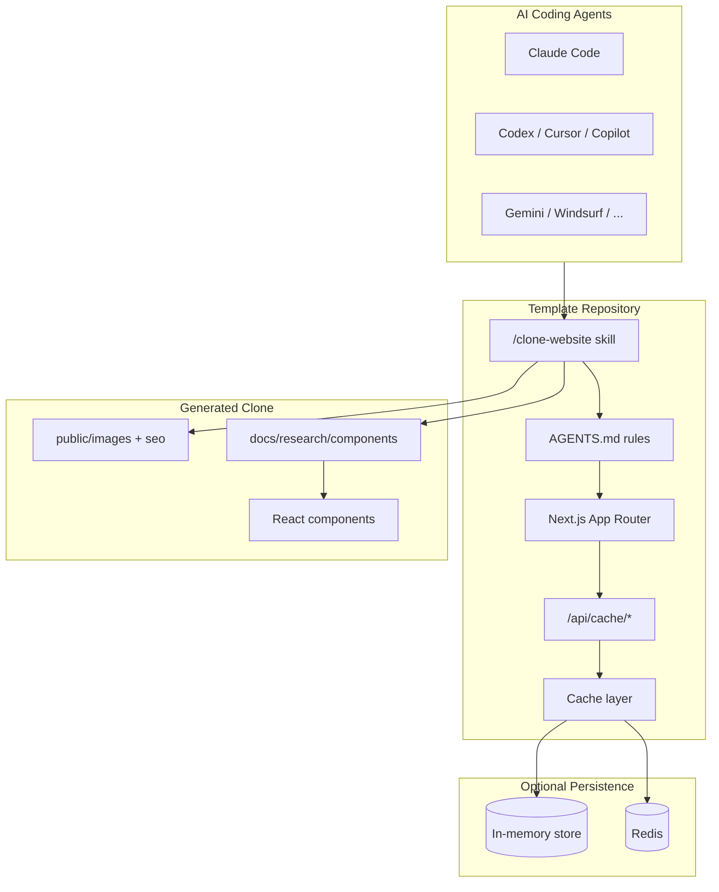
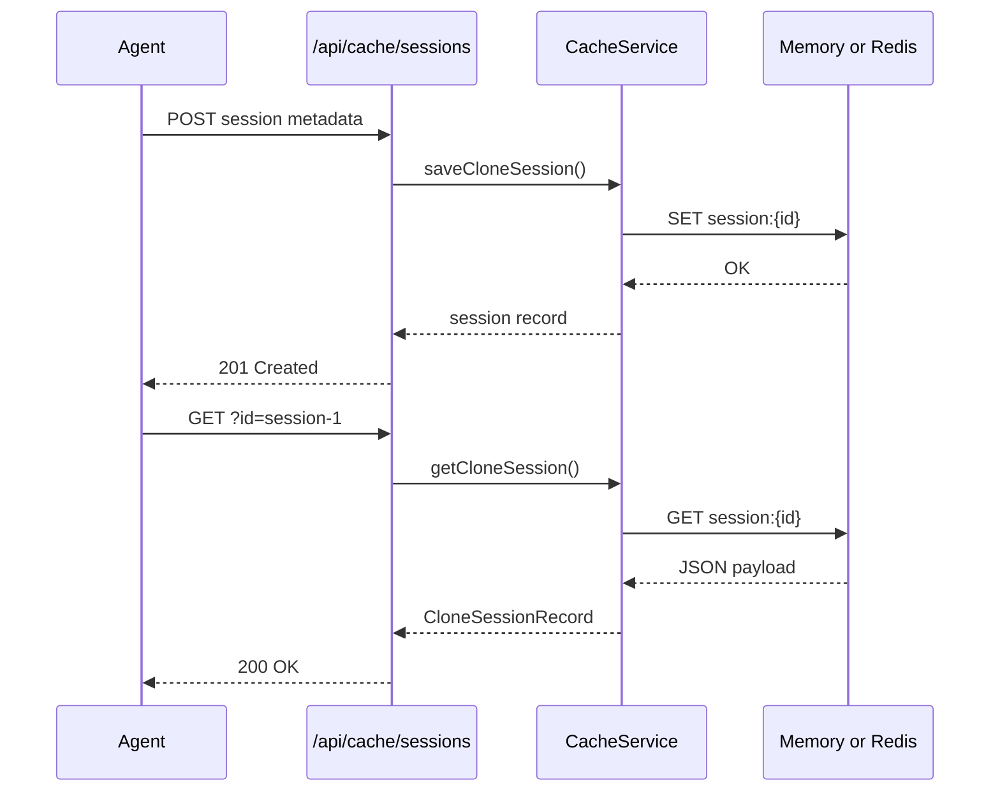
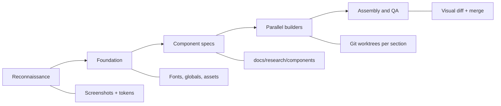

# Website Cloner — Next.js Agent Template

A production-oriented starter for rebuilding live websites as typed Next.js applications with AI coding agents. The template ships a strict TypeScript toolchain, optional Redis-backed session persistence, and multi-platform agent skills so `/clone-website` workflows stay reproducible across teams.

> **Start from your own copy.** Use GitHub **Use this template** to create a separate repository. Do not commit generated clone output back to this upstream template.

---

## Table of contents

- [Why this template](#why-this-template)
- [System architecture](#system-architecture)
- [Clone workflow](#clone-workflow)
- [Features](#features)
- [Requirements](#requirements)
- [Installation](#installation)
- [Configuration](#configuration)
- [Development](#development)
- [Testing](#testing)
- [Project structure](#project-structure)
- [Troubleshooting](#troubleshooting)
- [Contributing](#contributing)
- [FAQ](#faq)
- [License](#license)

---

## Why this template

Most website rebuilds fail in the handoff between design extraction and component implementation. This repository standardizes that boundary:

| Concern | Approach |
|---------|----------|
| Agent instructions | Single source in `AGENTS.md`, synced to 10+ platforms |
| Design fidelity | Component specs with computed CSS values in `docs/research/` |
| Runtime quality | Strict TypeScript, ESLint, Vitest, and CI validation |
| Session continuity | Optional Redis cache for multi-step clone pipelines |
| Deployment | Standalone Next.js output with Docker Compose |

---

## System architecture



### Cache layer



---

## Clone workflow



Run inside your agent:

```text
/clone-website https://example.com
```

Phases are defined in `.claude/skills/clone-website/SKILL.md` and propagated to other platforms via `npm run sync:skills`.

---

## Features

- **Strict TypeScript** — `noUnusedLocals`, no `allowJs`, separate configs for app, scripts, and tests
- **Optional Redis persistence** — connection manager with retry, graceful shutdown, and typed config
- **In-memory fallback** — zero external services required for local development
- **Cache HTTP API** — health probe and clone-session CRUD at `/api/cache/*`
- **Multi-platform skills** — one skill source, nine generated platform targets
- **Docker Compose stack** — app, dev, and Redis services with health checks
- **CI pipeline** — lint, typecheck, test, and build on every push

---

## Requirements

| Tool | Version |
|------|---------|
| Node.js | 24+ (see `.nvmrc`) |
| npm | 10+ |
| Redis | 7+ (optional, via Docker Compose) |
| AI agent | Claude Code recommended; see `AGENTS.md` |

---

## Installation

```bash
# 1. Create your repository from the GitHub template UI

# 2. Clone your copy
git clone https://github.com/YOUR-ORG/YOUR-REPO.git
cd YOUR-REPO

# 3. Install dependencies (lockfile is local-only)
npm install

# 4. Copy environment defaults
cp .env.example .env

# 5. Start the dev server
npm run dev
```

Open [http://localhost:3000](http://localhost:3000). The placeholder page prompts you to run `/clone-website`.

### Docker

```bash
# Production-like container
docker compose up app --build

# Dev container with bind mount (port 3001 by default)
docker compose up dev --build

# Enable Redis-backed cache
REDIS_ENABLED=true docker compose up app redis --build
```

---

## Configuration

Environment variables (see `.env.example`):

| Variable | Default | Description |
|----------|---------|-------------|
| `LOG_LEVEL` | `info` | Application log level (`debug` … `error`) |
| `REDIS_ENABLED` | `false` | Use Redis instead of in-memory cache |
| `REDIS_URL` | `redis://127.0.0.1:6379` | Redis connection URL |
| `REDIS_KEY_PREFIX` | `website-cloner:` | Namespace for cache keys |
| `REDIS_CONNECT_TIMEOUT_MS` | `10000` | Connection timeout |
| `REDIS_MAX_RETRIES` | `5` | Reconnect attempts |
| `REDIS_DEFAULT_TTL_SECONDS` | `86400` | Default entry TTL (24 h) |
| `PORT` | `3000` | Production container port mapping |
| `DEV_PORT` | `3001` | Dev container port mapping |

### Cache API examples

```bash
# Health check
curl http://localhost:3000/api/cache/status

# Save clone session metadata
curl -X POST http://localhost:3000/api/cache/sessions \
  -H "Content-Type: application/json" \
  -d '{"session":{"id":"demo","targetUrl":"https://example.com","status":"pending","createdAt":"2026-01-01T00:00:00.000Z","updatedAt":"2026-01-01T00:00:00.000Z"}}'

# Load session
curl "http://localhost:3000/api/cache/sessions?id=demo"
```

---

## Development

| Command | Description |
|---------|-------------|
| `npm run dev` | Next.js development server |
| `npm run build` | Production build (standalone) |
| `npm run start` | Serve production build |
| `npm run lint` | ESLint across app, scripts, and tests |
| `npm run typecheck` | TypeScript for app, scripts, and tests |
| `npm run test` | Vitest unit tests |
| `npm run validate` | lint + typecheck + test + build |
| `npm run sync:skills` | Regenerate platform clone-website files |
| `npm run sync:agents` | Regenerate platform agent rule files |

### Sync workflow

| Source of truth | Generated targets | Command |
|-----------------|-------------------|---------|
| `AGENTS.md` | Copilot, Cline, Continue, Amazon Q | `npm run sync:agents` |
| `.claude/skills/clone-website/SKILL.md` | Codex, Cursor, Gemini, … | `npm run sync:skills` |

Internal audit notes: [`docs/internal/AUDIT.md`](docs/internal/AUDIT.md).

---

## Testing

Tests live under `tests/` and run with Vitest:

```bash
npm test           # single run
npm run test:watch # watch mode
```

Coverage includes:

- Environment configuration parsing
- In-memory cache TTL and CRUD behavior
- Redis store operations (mocked client)
- Clone session helper functions

CI executes the same suite on Node 24 for every pull request.

---

## Project structure

```
.
├── src/
│   ├── app/                 # Next.js routes and API handlers
│   │   └── api/cache/       # Cache health + session endpoints
│   ├── components/ui/       # shadcn/ui primitives
│   ├── hooks/               # Shared React hooks (scaffold)
│   ├── lib/
│   │   ├── cache/           # Memory + Redis cache backends
│   │   ├── config/          # Typed environment configuration
│   │   ├── errors/          # Application error types
│   │   └── logger/          # Structured logging utility
│   └── types/               # Shared TypeScript interfaces
├── tests/cache/             # Vitest unit tests
├── scripts/                 # TypeScript build/sync tooling
├── docs/
│   ├── internal/            # Engineering audit notes
│   └── research/            # Agent extraction output (generated)
├── .claude/skills/          # Canonical clone-website skill
├── docker-compose.yml       # app + dev + redis services
├── vitest.config.ts
├── tsconfig.json            # App compiler config
├── tsconfig.scripts.json    # Scripts compiler config
└── tsconfig.test.json       # Test compiler config
```

**Design decisions**

- `src/lib/cache/` isolates persistence from API routes so agents can reuse cache logic in scripts.
- `tests/` is top-level (not colocated) to keep production bundles lean.
- Lockfiles are intentionally gitignored; CI uses `npm install`.

---

## Troubleshooting

| Symptom | Likely cause | Fix |
|---------|--------------|-----|
| `Redis is disabled` API error | `REDIS_ENABLED=false` | Set `REDIS_ENABLED=true` and start Redis |
| Cache ping returns 503 | Redis unreachable | Check `REDIS_URL`, run `docker compose up redis` |
| `Session-store bridge not found` (legacy docs) | Outdated instructions | Use `/api/cache/status` instead |
| Typecheck fails on scripts | Wrong working directory | Run commands from repository root |
| ESLint ignores tests | Stale config | Ensure `eslint .` includes `tests/` |
| Docker healthcheck fails | App still compiling | Increase `start_period` in compose file |
| Agent cannot find skill | Platform copy stale | Run `npm run sync:skills` |

---

## Contributing

1. Fork the template and create a feature branch.
2. Run `npm install && npm run validate` before opening a PR.
3. Keep commits focused; avoid unrelated refactors.
4. Update `.env.example` when adding configuration keys.
5. Regenerate platform files if you edit `AGENTS.md` or the clone skill.

Pull requests should include a test plan listing commands run and any manual verification steps.

---

## FAQ

**Do I need Redis?**  
No. The default in-memory backend works for single-machine agent runs. Enable Redis when multiple agents or CI runners share clone session state.

**Can I use this without Claude Code?**  
Yes. Run `npm run sync:skills` after editing the canonical skill. Most agents read `AGENTS.md` or their platform-specific copy automatically.

**Will this copy any website automatically?**  
No. The template provides scaffolding and agent instructions. A coding agent still performs extraction, spec writing, and component generation.

**Is scraping always legal?**  
No. Verify ownership, licensing, and target site terms before cloning. See the ethical use section in `AGENTS.md`.

**Why is `package-lock.json` ignored?**  
This template optimizes for fork-level dependency resolution. Generate the lockfile locally with `npm install`.

---

## License

MIT — see [LICENSE](LICENSE).
